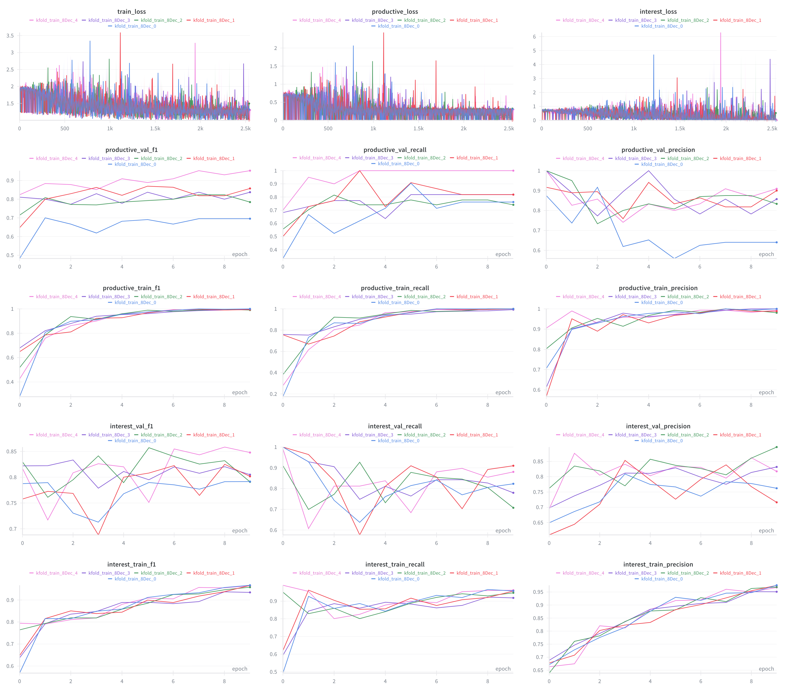
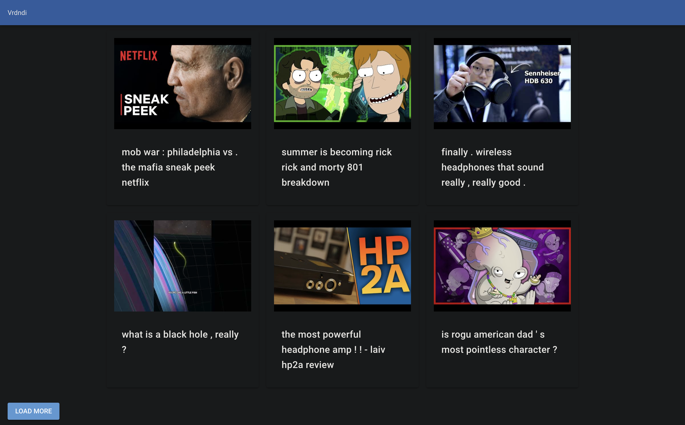
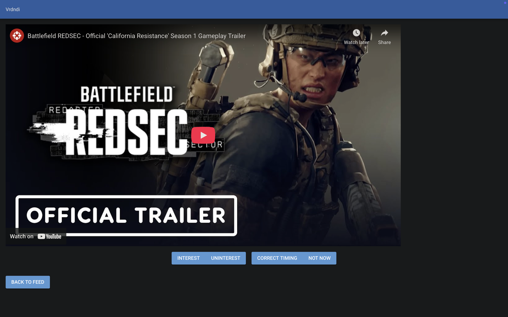

# Vrdndi

Vrdndi (Verdandi) is a full-stack recommendation system that processes your media data (currently YouTube) to provide a personal feed based on what you did previously on your computer (i.e dynamically changing the feed based on time and previous app history)

The primary goal of this project is not to increase your watch time in your feed like other recommendation systems. It's the opposite: minimize your watch time and increase your productivity, but keep you interested.
*At least, that's the plan.*

> ⚠️ **Note:** Vrdndi is currently in **Alpha**. The core features are functional, but the model architecture is still experimental. Real-world performance is unverified. For more detail, see [Limitation](#limitation)


## Hardware requirement

Some references:

- RTX 3060 laptop with 16 GB RAM works well for this project.
- M1 Macbook Air with 16 GB RAM can run the inference and might be able to run training pipelines with `batch_size = 1`(with GA), but end-to-end training hasn't been tested.


## Installation (Quick Start)

**Step 1**: Clone the repository

```bash
git clone https://github.com/leuas/Vrdndi.git
cd vrdndi
```

**Step 2**: Install pytorch for your GPU

Go to [Pytorch Get Started](https://pytorch.org/get-started/locally/), select the version that matches your hardware, and install it.

For example:
```bash
pip3 install torch torchvision --index-url https://download.pytorch.org/whl/cu128
```

**Step 3**: Install the package. Since you may need to adjust model hyperparameters , we recommend installing it in editable mode.

```bash
pip install -e . 
```
>**Note**: This installs the core library for running the Demo. To set up the full system (i.e. ActivityWatch & Database), please see the [Usage Guide](docs/USAGE.md)

## Usage/Examples

**Quick start:**

Show the basic model inference. For detailed adjustments of the demo, please see the docstring in ``demo.py``

```bash
cd Vrdndi/scripts

python demo.py
```

For general usage, please see the [Usage Guide](docs/USAGE.md)


## System Architecture

As shown in the picture below, the system fetches data from YouTube API and your local ActivityWatch server. It uses this data to predict your feed and uses database to transfer feed to website.

**End-to-End Pipelines**:


## Model Structure

Currently Vrdndi uses fine-tuned BGE-m3 to predict the media feed. 

### Main Structure: 

There are two types of inputs:

1. **Media Data**: Textual data (Title/Description). Directly processed by the BGE-M3 embedding layer.

2. **App Sequence Data**: Activity history from ActivityWatch. Processed by a custom sequential residual block to encode the sequence into a single token.
    > Sequence data is pre-computed before running the main model to save memory usage. (Text part would be encoded by Sentence Transformer)


### Residual Block: 

Used a pre-activation structure instead of post-activation for the Residual block; added an SE block to "gate" each token to pick out the important one;  and replaced the common GELU with SiLU to keep consistency with SWiGLU, since they are almost interchangeable.


>**Why AdaLN:** Duration is a numerical value, it can't go through the BGE-M3's embedding layer, so it has to be either a separate token or a condition to diffuse the AW data. The former seemingly caused distribution mismatch(?) during testing, so the latter approach was chosen.


### Output Layer:

The output layer has two heads: an *interest* head and a *productive* head. The interest head acts as a transition before you have enough *productive* data(i.e. The data you labelled on the website).  The *productive* head predicts a rate based on previous app history, current time for each media data. 


>**Why SWiGLU:** Previously the interest head couldn't quite converge (at least the fluctuation was larger than now), and since the sequence compressor for interest head is partially functional -- it won't receive an app sequence to predict interest, so the output token just represents the duration diffused in it. Hence, adding a strong activation function in output layer seems like a good move.
>
>The productive head was also switched to SWiGLU at that time for convenience, though it seems to have caused the overfitting problem Vrdndi is facing currently.  

## Model Performance

The performance is fairly good, one of the 5 folds could reach 0.95 f1, which is suspiciously high. However, since only one fold reached that and the dataset used for testing was quite small (200-300 for productive, roughly 1000 for interest), the result is acceptable. And the model structure is decent enough, as the test may have shown.

>**Note**: The *productive* loss plateau you see in the diagram is likely caused by `0.5` output layer dropout.
> And the instability of the *interest* loss is likely caused by the configuration used (`0.75` interest sampling rate, but `0.33` interest loss weight).

**Productive head's mean F1 performance with Standard Deviation**:


**More performance detail**:




## Website
The NiceGUI website is functional, allowing you to watch videos, scroll the feed and give feedback.

Main page would render 21 videos at once. Press ``LOAD MORE`` button to get more videos.


**Main Page**:


**Video Page**:


>For streamlit data labelling website, please see [Usage Guide](docs/USAGE.md)


## Privacy
**Data Privacy**

All data that's used in this project is processed locally and stores in the ``data/`` folder. You have full control over it.

**Internet Requirement**
* **Pipelines**: Once you download the base BGE-M3 model, Sentence Transformer, its tokenizers and training data, you can run it offline.

* **Website**: The local website needs Internet access to render YouTube video. 


## Limitation
Technically, the model *can* aim for productivity if you have enough high-quality data. But it's really difficult to reach since current state of the project doesn't do anything to explicitly form the feed in a way to achieve the primary goal.


It's more like keeping or organizing your feed as you want, even if it's not in a *productive* way. In the future version, we may reach that goal. (Say add RL?)

With the current test dataset, **sometimes** the model *can* give a good feed, which is not fully for productivity. (Might be caused by small dataset and noise) Again, the current architecture is experimental; likely more data (more time) is required for further improvement


## File Strcuture

```
.
├── artifacts/                              # Model artifacts                           
├── data                                     
│   ├── database                            # SQLite database files
│   ├── processed           
│   │   ├── inference                       # Offline encoded tensors for inference
│   │   └── train                           # Offline encoded tensors for training
│   └── raw                                 # Raw data(e.g. watch-history.json)
├── docs/                                   # Documentation and images
├── pyproject.toml
├── pytest.ini
├── scripts/                                # Demo, training and scheduler scripts
├── secrets/                                # API token and client secrets (put yours there)
├── src
│   ├── assets/                             # Stopwords
│   ├── config.py                           # Global configuration parameters
│   ├── path.py                             # Path constants
│   ├── db/                                 # Database class
│   ├── inference                           # Inference
│   │   ├── baseline.py
│   │   └── productive.py                   # Main model inference class
│   ├── model_dataset                       # Dataset
│   │   ├── loader.py                       # Dataloader class
│   │   └── productive.py                   # Dataset class of main model
│   ├── model
│   │   ├── activitywatch_encoder.py        # The model that encodes the text of the app sequence 
│   │   ├── components.py                   # Defines some model layers (e.g. AdaLN)
│   │   └── productive.py                   # Main model class
│   ├── pipelines                           # Training pipelines
│   │   ├── baseline.py
│   │   └── productive.py                   # Pipelines of main model
│   ├── utils
│   │   ├── data_etl.py                     # Processes data from API
│   │   └── ops.py                          # Data operation for model training or inference 
│   ├──web
│   │   └── website_frontend.py             # NiceGUI website frontend
│   └── streamlit                          
│       └──  data_labeler.py                # Streamlit website code                
└── test 

```


## Backlog

- Add YouTube transcripts as one of the model feature

- Add video upload time as the condition of AdaLN

- Add more media sources (e.g. Email, RSS feed,etc) 

- Refine the feed display method (i.e. not just display the highest rated items)

- Improve website's appearance

- Display original video titles instead of lowercase ones

- Write an automatic function to clean offline tensor files

- Fix the productive inference test function

- Organise configuration class

- Error handling for ``get_classes`` 

- Write a `check_if_table_exists` function in *interest data* preprocess


## Notes

Since this is my very first project in code (except code practise), and I'm still new to programming and ML. I may have missed something completely.

If you find any bugs/issues or problems with the architecture (e.g.,if the architecture causes convergence problems) or anything else. Please feel free to open an issue or even submit a PR!

Thank you for reading this far. If you find this project interesting, giving it a star would be really helpful.


## Related

- [ActivityWatch](https://activitywatch.net/)
- [NiceGUI](https://nicegui.io/)
- [Streamlit](https://streamlit.io/)
- [Pytorch](https://pytorch.org/)
- [SQLite](https://sqlite.org/)


